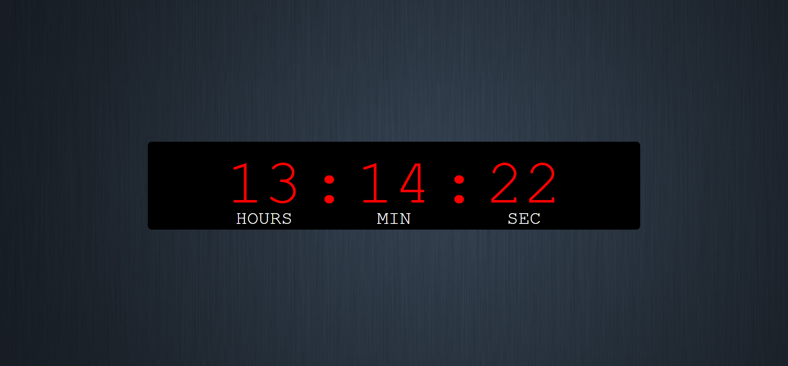

# ⏰ Digital Clock

This **Digital Clock** is a simple, elegant, and fully responsive clock that displays the current time in real-time. Built using HTML, CSS, and JavaScript, it offers a clean and minimal design that works seamlessly across all devices.

---

## Features

- **Real-Time Display**: Shows the current time that updates every second.
- **Responsive Design**: Optimized for desktop, tablet, and mobile screens.
- **Modern UI**: Minimalistic and clean interface.

---
  

---

## Technologies Used

- **HTML5** for structuring the clock.
- **CSS3** for styling and responsive layout.
- **JavaScript (ES6)** for real-time functionality.

---
